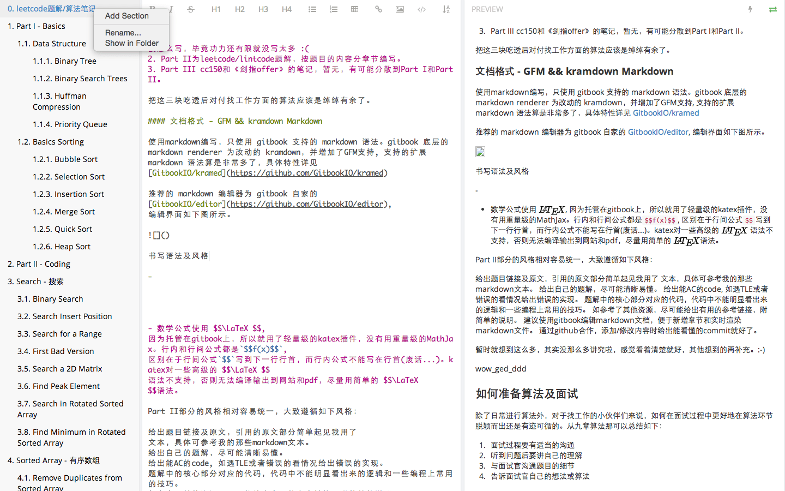

# leetcode/lintcode题解/算法学习笔记

一晃就研二下了，离毕业也只有短短一年，终于快逃出无线通信的魔爪了，想想就有点小激动啊，由于自己是非CS科班出身，一些CS方面的基础肯定是得在找工作/实习之前夯实的啦，比如数据结构和算法、编程语言、操作系统、数据库等等啦，最最重要的自然就是算法和编程语言了咯。本着独乐乐不如众乐乐的开源精神，我将自己的算法学习笔记公开和小伙伴们讨论，希望高手们不吝赐教。

## 如何准备算法及面试

除了日常进行算法外，对于找工作的小伙伴们来说，如何在面试过程中更好地在算法环节脱颖而出还是有迹可循的。从九章算法那可以总结如下：

1. 面试过程要有适当的沟通
1. 听到问题后要讲自己的理解
2. 与面试官沟通题目的细节
3. 告诉面试官自己的想法或算法

虽说练习算法偏向于算法本身，但是好的代码风格还是很有必要的。粗略可分为以下几点：

- 代码块可为三大块：异常处理（空串和边界处理），主体，返回
- 代码风格(**可参考Google的编程语言规范**)
    1. 变量名的命名(有意义的变量名)
    2. 缩进(语句块)
    3. 空格(运算符两边)
    4. 代码可读性(即使if语句只有一句也要加花括号)
- 《代码大全》中给出的参考

而对于实战算法的过程中，我们可以采取如下策略：

1. 总结归类相似题目
2. 找出适合同一类题目的模板程序
3. 对基础题熟练掌握

以下整理了一些最近练习算法的网站资源，和大家共享之。

### 在线OJ及部分题解

1. [LintCode | Coding interview questions online training system](http://www.lintcode.com) - 和leetcode类似的在线OJ，但是筛选比较方便，还可以在`source`处选择cc150或者其他来源的题。目前会根据系统locale选择中文或者英文，评判时也比leetcode快，总之是比较赞啦
2. [LeetCode Online Judge](https://leetcode.com/) - 找工作方面非常出名的一个OJ，相应的题解非常多
3. [LeetCode题解 - GitBook](https://www.gitbook.com/book/siddontang/leetcode-solution/details) - 题解部分十分详细，比较容易理解
4. [soulmachine/leetcode](https://github.com/soulmachine/leetcode) - 含C++和Java两个版本的题解
5. [Woodstock Blog](http://okckd.github.io/) - IT，算法及面试。有知识点及类型题总结，特别赞
6. [Acm之家,专业的ACM学习网站](http://www.acmerblog.com/) - 各类题解
7. [牛客网-专业IT笔试面试备考平台,最全求职题库,全面提升IT编程能力](http://www.nowcoder.com/) - 国内一个IT求职方面的综合性网站，比较适合想在国内求职的看看。感谢某位美女的推荐 :)

### 其他资源

- [有哪些学习算法的网站推荐？ - 知乎](http://www.zhihu.com/question/20368410)
- [九章算法 | 帮助更多的中国人找到好工作，美国硅谷一线工程师实时在线授课](http://www.jiuzhang.com/) - 代码质量不错，整理地也很好。
- [七月算法 - julyedu.com](http://julyedu.com/) - july大神主导的在线算法辅导
- [结构之法 算法之道](http://blog.csdn.net/v_JULY_v) - 不得不服！
- [julycoding/The-Art-Of-Programming-By-July](https://github.com/julycoding/The-Art-Of-Programming-By-July) - 程序员面试艺术的电子版
- [程序员面试、算法研究、编程艺术、红黑树、数据挖掘5大系列集锦](http://blog.csdn.net/v_july_v/article/details/6543438)
- [POJ的部分题解 - Category: POJ | Beeder's Blog](http://beeder.me/categories/POJ/)
- [专栏：算法笔记——《算法设计与分析》](http://blog.csdn.net/column/details/lf-algoritnote.html) - CSDN上对《算法设计与分析》一书的学习笔记。
- [算法练习 | billryan](http://algorithm.yuanbin.me) - 恬不知耻地贴上了作为CS门外汉刷题的总结和笔记，求大神们轻拍

### 书籍推荐

- [Algorithm Design (豆瓣)](http://book.douban.com/subject/1475870/)
- [The Algorithm Design Manual](http://www.amazon.com/exec/obidos/ASIN/1848000693/thealgorithmrepo), 作者还放出了自己上课的视频和slides - [Skiena's Audio Lectures](http://www3.cs.stonybrook.edu/~algorith/video-lectures/)，[The Algorithm Design Manual (豆瓣)](http://book.douban.com/subject/3072383/)
- 大部头有 *Introduction to Algorithm* 和 TAOCP

## About - 关于本文档

- 本笔记的在线托管仓库为 https://github.com/billryan/algorithm-excercise
- 在线阅读网址为 http://algorithm.yuanbin.me 在线阅读的网页通过gitbook后端生成，推送到github后会触发gitbook的编译，编译状态 - 
    1. Read on the [website](http://algorithm.yuanbin.me). **Recommended**
    2. [PDF](https://www.gitbook.com/download/pdf/book/yuanbin/algorithm)
    3. [EPUB](https://www.gitbook.com/download/epub/book/yuanbin/algorithm)
    4. [MOBI](https://www.gitbook.com/download/mobi/book/yuanbin/algorithm)
- 全文大体上分为两大部分，第一部分为算法基础，是自己参考书籍及一些网页的总结；第二部分为代码实战，是自己在leetcode/lintcode上刷题的总结。
- 本文档使用 [Creative Commons — Attribution-ShareAlike 4.0 International — CC BY-SA 4.0](https://creativecommons.org/licenses/by-sa/4.0/) 进行授权。你可以在github中star本项目查看更新。

主要内容为学习算法和刷leetcode/lintcode过程中的笔记，很大程度上参考了[九章算法](http://www.jiuzhang.com) 的代码和讲稿，先行谢过！同时也参考了一些其他教材和优质博客，凡参考过的几乎都给出明确链接，如果不小心忘记了，请不要吝惜你的评论和issue :)

### Contribution - 如何贡献本文档

如果你发现本文档有任何可以改进之处，欢迎提交你的改进，具体形式有如下几种。

1. 成为本项目的contributor, 发邮件并把你的github账户名告诉我就可以了，我收到邮件后把你的github账号加到Collaborators中。
2. 提交Pull Request, fork本文档的github repo, 发PR给我就好了。
3. 在本文档的github repo处提交issue, 指出有问题的地方。
4. 在 website http://algorithm.yuanbin.me 相应网页下的disqus评论框中添加评论，指出一些typo或者可以改进的地方。

既然涉及到文档合作，那么最好是能有个像样的文档规范之类的东西方便大家更好的合(jiao)作(ji)，目前想到的有如下几点。

#### 全文组织架构

1. Part I为基础知识复习，介绍一些基础的排序/链表/基础算法，这一块目前我没怎么写，毕竟功力还有限就没写太多 :(
2. Part II为leetcode/lintcode题解，按题目的内容分章节编写。
3. Part III cc150和《剑指offer》的笔记，暂无，有可能分散到Part I和Part II。

把这三块吃透后对付找工作方面的算法应该是绰绰有余了。

#### 文档格式及编辑工具 - GFM && kramdown Markdown

使用markdown编写，只使用 gitbook 支持的 markdown 语法。gitbook 底层的 markdown renderer 为改动的 kramdown，并增加了GFM支持, 支持的扩展 markdown 语法算是非常多了，具体特性详见 [GitbookIO/kramed](https://github.com/GitbookIO/kramed)

推荐的 markdown 编辑器为 gitbook 自家的 [GitbookIO/editor](https://github.com/GitbookIO/editor), 支持 Windows/Linux/MAC 三大平台，业界良心！但是实测在Arch Linux下可能会出现占用内存过高的情况... OS X 下目前表现还算良好，编辑界面如下图所示，最左边为章节预览，中间为 markdown 编辑框，右边为实时渲染页面，可选择使用全屏模式。

使用其他如 Mou/Vim/Emacs/Sublime Text也不错，但是在新增Chapter/Section时就比较闹心了，嗯，你也可以新建 Section 后再使用其他编辑器编辑。

对 Gitbook 不熟的建议看看 [Gitbook Documentation](http://help.gitbook.com/)，有助于了解 http://algorithm.yuanbin.me 网页上的文字及各章节等是如何编辑及渲染的。

#### 章节名及编号

章节等文件名全部采用英文，子章节最多到三级，章节编号无需操心，这种琐事交给 Gitbook 去做就好，如果一定要手动调整，修改`SUMMARY.md`文件，注意其中的缩进关系，Gitbook就指望这个自动给章节编号了。

举个例子，我现在想新增「动态规划」及其子章节。首先在 Gitbook 顶部菜单栏「Book」中找到「Add Chapter」，填入「Dynamic Programming」。好了，在Gitbook左侧章节栏中就能看到新生成的「10. Dynamic Programming」了，左键击之，Gitbook 就会生成「dynamic_programming」目录及本章的说明文件「dynamic_programming/README.md」。如果想在「10. Dynamic Programming」下新增子章节，右键击之，「Add Section」即可，同上，子章节文件名仍然使用英文名，网页显示的标题可以通过 rename 更改再加入中文。

嗯，以上步骤均可直接新建文件夹及操作`SUMMARY.md`文件完成。

#### 数学公式

其实代码里是用不着写数学公式的，但是偶尔分析算法可能会用着，用过 LaTeX 的都知道她生成的数学公式有多优雅，以至于不用她来写数学公式都有点不舒服...

这个文档里对于较复杂的数学公式建议使用 LaTeX, 因为托管在gitbook上，所以就用了轻量级的katex插件，没有用重量级的 MathJax。行内和行间公式都是 两个$, 区别在于行间公式写到下一行行首，而行内公式不能写在行首(废话...)。katex非常脆弱，对一些高级的 LaTeX 语法不支持，否则无法编译输出到网站和pdf，尽量用简单的 LaTeX 语法或者不用。

#### 正文书写风格

1. 中英文混排贯穿全文，优雅美观起见，尽可能在英文单词前后加空格。
2. 代码的函数名或短代码建议使用 \`code\`
3. 使用空行进行分段，嗯，markdown通用

Part II为leetcode/lintcode题解，这部分的风格相对容易统一，大致遵循如下风格：

1. 给出题目链接及原文，引用的原文部分简单起见我对题目使用了blockquote ，具体可参考我的那些markdown文本。
2. 给出自己的题解，尽可能清晰易懂。
3. 给出能AC的code, 如遇TLE或者错误的看情况给出错误的实现。使用blockquote, 给出语言类别以便高亮。具体可参看原markdown文件。
4. 题解中的核心部分对应的代码，代码中不能明显看出来的逻辑和一些编程上常用的技巧。
5. 如参考了其他资源，尽可能给出有用的参考链接，附简单的说明。

感觉还不错的风格 - [raw binary_tree_preorder_traversal.md](https://raw.githubusercontent.com/billryan/algorithm-excercise/master/binary_tree/binary_tree_preorder_traversal.md)

通过github合作时，添加/修改内容时给出能看懂的commit就好了。暂时就想到这么多，其实没那么多讲究啦，感觉看着清楚就好，其他想到的再补充。:-)

#### 附件及图片引用

图片统一存放在`figure`目录下，其他附件存放在`docs`目录下。引用图片链接一般可以通过``声明。

图片体积太大不利于页面加载，建议先压缩后再放入，如果是png图片可考虑使用 [TinyPNG – Compress PNG images while preserving transparency](https://tinypng.com/)
