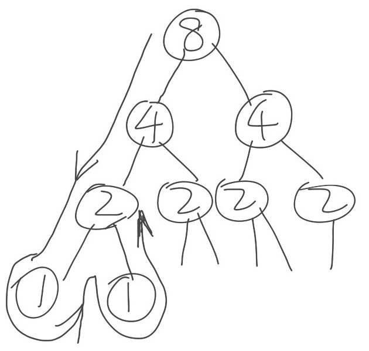

# Quick Sort - 快速排序

核心：快排是一种采用分治思想的排序算法，大致分为三个步骤。

1. 定基准——首先随机选择一个元素最为基准
2. 划分区——所有比基准小的元素置于基准左侧，比基准大的元素置于右侧，
3. 递归调用——递归地调用此切分过程。

## 递归实现

容易实现和理解的一个方法是采用递归，Python 的实现如下所示：

```python
#!/usr/bin/env python


def qsort(alist):
    print(alist)
    if len(alist) <= 1:
        return alist
    else:
        pivot = alist[0]
        return qsort([x for x in alist[1:] if x < pivot]) + \
               [pivot] + \
               qsort([x for x in alist[1:] if x >= pivot])

unsortedArray = [6, 5, 3, 1, 8, 7, 2, 4]
print(qsort(unsortedArray))
```

输出如下所示：

```
[6, 5, 3, 1, 8, 7, 2, 4]
[5, 3, 1, 2, 4]
[3, 1, 2, 4]
[1, 2]
[]
[2]
[4]
[]
[8, 7]
[7]
[]
[1, 2, 3, 4, 5, 6, 7, 8]
```

递归 + not-in-place 的实现虽然简单易懂，但是如此一来『快速排序』便不再是『最快』的排序算法了，因为递归调用过程中空间复杂度颇高。

### 复杂度分析

在最好情况下，快速排序的基准元素正好是整个数组的中位数，可以近似为二分，那么最好情况下递归的层数为 $$\log n$$, 咋看一下每一层的元素个数都是 $$n$$, 那么空间复杂度为 $$O(n)$$ 无疑了，不过这只答对了一半，从结论上来看是对的，但分析方法是错的。

首先来看看什么叫空间复杂度——简单来讲可以认为是程序在运行过程中所占用的存储空间大小。那么对于递归的 out-in-place 调用而言，排除函数调用等栈空间，**最好情况下，每往下递归调用一层，所需要的存储空间是上一层中的一半。完成最底层的调用后即向上返回执行出栈操作，故并不需要保存每层所有元素的值。**所以需要的总的存储空间就是
$$\sum _{i=0} ^{} \frac {n}{2^i} = 2n$$

不是特别理解的可以结合下图的非严格分析和上面 Python 的代码，递归调用的第一层保存8个元素的值，那么第二层调用时实际需要保存的其实仅为4个元素，逐层往下递归，而不是自左向右保存每一层的所有元素。

那么在最坏情况下 out-in-place 需要耗费多少额外空间呢？最坏情况下第 $$i$$ 层需要 $$i - 1$$ 次交换，故总的空间复杂度：

$$\sum_{i=0}^n (n-i+1) = O(n^2)$$



## in-place - 原地快排

先来一张动图看看快速排序的过程。


1. 选中`3`作为基准
2. `lo`指针指向元素`6`, `hi`指针指向`4`, 移动`lo`直至其指向的元素大于等于`3`, 移动`hi`直至其指向的元素小于`3`。找到后交换`lo`和`hi`指向的元素——交换元素`6`和`2`。
3. `lo`递增，`hi`递减，重复步骤2，此时`lo`指向元素为`5`, `hi`指向元素为`1`. 交换元素。
4. `lo`递增，`hi`递减，发现其指向元素相同，此轮划分结束。递归排序元素`3`左右两边的元素。

与归并排序的区别：

- 归并排序将数组分成两个子数组分别排序，并将有序的子数组归并以将整个数组排序。递归调用发生在处理整个数组之前。
- 快速排序将一个数组分成两个子数组并对这两个子数组独立地排序，两个子数组有序时整个数组也就有序了。递归调用发生在处理整个数组之后。

Robert Sedgewick 在其网站上对 [Quicksort](http://algs4.cs.princeton.edu/23quicksort/) 做了较为完整的介绍，建议去围观下。

## Reference

- [快速排序 - 维基百科，自由的百科全书](http://zh.wikipedia.org/wiki/%E5%BF%AB%E9%80%9F%E6%8E%92%E5%BA%8F)
- [Quicksort |  Robert Sedgewick](http://algs4.cs.princeton.edu/23quicksort/)
