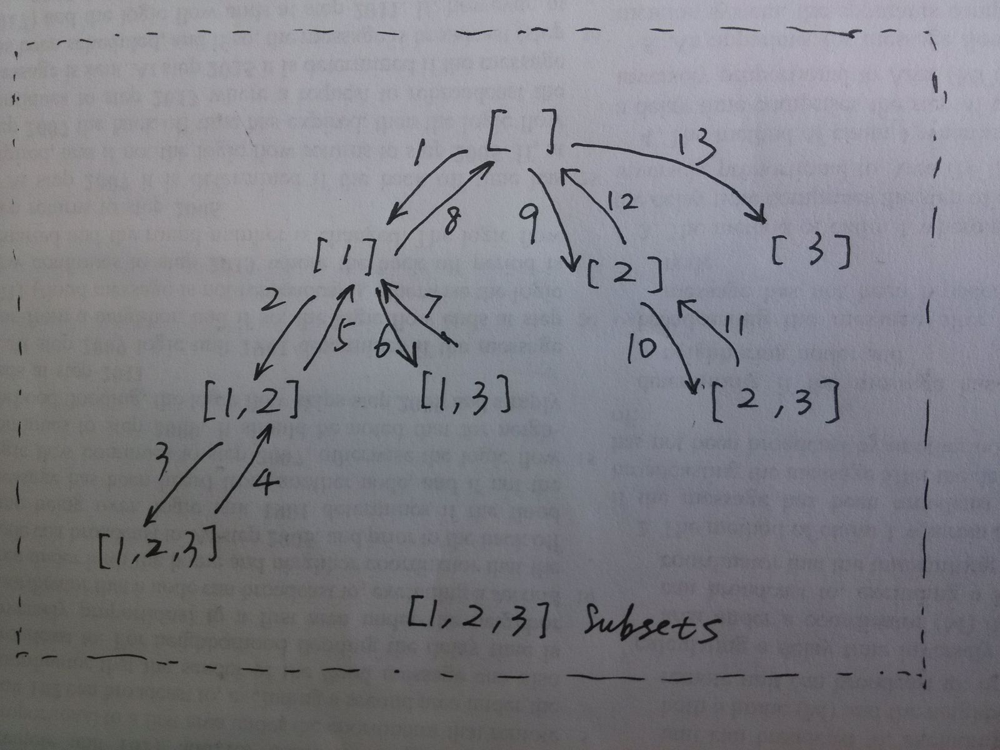

# Subsets - 子集

## Question

- leetcode: [Subsets | LeetCode OJ](https://leetcode.com/problems/subsets/)
- lintcode: [(17) Subsets](http://www.lintcode.com/en/problem/subsets/)

### Problem Statement

Given a set of distinct integers, _nums_, return all possible subsets.

#### Note:

  * Elements in a subset must be in non-descending order.
  * The solution set must not contain duplicate subsets.

For example,  
If _nums_ = `[1,2,3]`, a solution is:

    [
      [3],
      [1],
      [2],
      [1,2,3],
      [1,3],
      [2,3],
      [1,2],
      []
    ]

## 题解

子集类问题类似Combination，以输入数组`[1, 2, 3]`分析，根据题意，最终返回结果中子集类的元素应该按照升序排列，故首先需要对原数组进行排序。题目的第二点要求是子集不能重复，至此原题即转化为数学中的组合问题。我们首先尝试使用 DFS 进行求解，大致步骤如下：

1. `[1] -> [1, 2] -> [1, 2, 3]`
2. `[2] -> [2, 3]`
3. `[3]`

将上述过程转化为代码即为对数组遍历，每一轮都保存之前的结果并将其依次加入到最终返回结果中。

### Iterative
### Python
```python
class Solution:
    """
    @param S: The set of numbers.
    @return: A list of lists. See example.
    """
    def subsets(self, S):
        if not S:
            return []
        ret = []
        S.sort()
        n = len(S)
        # 000 -> []
        # 001 -> [1]
        # 010 -> [2]
        # ...
        # 111 -> [1, 2, 3]
        for i in xrange(2**n):
            tmp = []
            for j in xrange(n):
                if i & (1 << j):
                    tmp.append(S[j])
            ret.append(tmp)
        return ret
```
### 源码分析
利用类似`bit map`的原理， 将 0 ~ $$2^n - 1$$个数值map到每个index上，如果index数值为1，就将该number加入。比如输入是`[1 ,2 ,3]`, 那么当`i = 0`时，`0`也就是`000`， 那么`000 -> []`； 当`i = 1`时， `001 -> [1]`; 直到`i = 7`, `111 -> [1, 2, 3]`.


### Recursive
### Python

```python
class Solution:
    # @param {integer[]} nums
    # @return {integer[][]}
    def subsets(self, nums):
        if nums is None:
            return []

        result = []
        nums.sort()
        self.dfs(nums, 0, [], result)
        return result

    def dfs(self, nums, pos, list_temp, ret):
        # append new object with []
        ret.append([] + list_temp)

        for i in xrange(pos, len(nums)):
            list_temp.append(nums[i])
            self.dfs(nums, i + 1, list_temp, ret)
            list_temp.pop()
```

#### less code style
```python
class Solution:
    """
    @param S: The set of numbers.
    @return: A list of lists. See example.
    """
    def subsets(self, S):
        ret = []
        self.helper(sorted(S), ret, [])
        return ret

    def helper(self, vals, ret, tmp):
        ret.append(tmp[:])
        for i, val in enumerate(vals):
            self.helper(vals[i + 1:], ret, tmp + [val])
```

### C++

```c++
class Solution {
public:
    vector<vector<int>> subsets(vector<int>& nums) {
        vector<vector<int> > result;
        if (nums.empty()) return result;

        sort(nums.begin(), nums.end());
        vector<int> list;
        dfs(nums, 0, list, result);

        return result;
    }

private:
    void dfs(vector<int>& nums, int pos, vector<int> &list,
             vector<vector<int> > &ret) {

        ret.push_back(list);

        for (int i = pos; i < nums.size(); ++i) {
            list.push_back(nums[i]);
            dfs(nums, i + 1, list, ret);
            list.pop_back();
        }
    }
};
```

### Java

```java
public class Solution {
    public List<List<Integer>> subsets(int[] nums) {
        List<List<Integer>> result = new ArrayList<List<Integer>>();
        List<Integer> list = new ArrayList<Integer>();
        if (nums == null || nums.length == 0) {
            return result;
        }

        Arrays.sort(nums);
        dfs(nums, 0, list, result);

        return result;
    }

    private void dfs(int[] nums, int pos, List<Integer> list,
                     List<List<Integer>> ret) {

        // add temp result first
        ret.add(new ArrayList<Integer>(list));

        for (int i = pos; i < nums.length; i++) {
            list.add(nums[i]);
            dfs(nums, i + 1, list, ret);
            list.remove(list.size() - 1);
        }
    }
}
```

### 源码分析

Java 和 Python 的代码中在将临时list 添加到最终结果时新生成了对象，(Python 使用`[] + `), 否则最终返回结果将随着`list` 的变化而变化。

**Notice: backTrack(num, i + 1, list, ret);中的『i + 1』不可误写为『pos + 1』，因为`pos`用于每次大的循环，`i`用于内循环，第一次写subsets的时候在这坑了很久... :(**

回溯法可用图示和函数运行的堆栈图来理解，强烈建议**使用图形和递归的思想**分析，以数组`[1, 2, 3]`进行分析。下图所示为`list`及`result`动态变化的过程，箭头向下表示`list.add`及`result.add`操作，箭头向上表示`list.remove`操作。



### 复杂度分析

对原有数组排序，时间复杂度近似为 $$O(n \log n)$$. 状态数为所有可能的组合数 $$O(2^n)$$, 生成每个状态所需的时间复杂度近似为 $$O(1)$$, 如`[1] -> [1, 2]`, 故总的时间复杂度近似为 $$O(2^n)$$.

使用了临时空间`list`保存中间结果，`list` 最大长度为数组长度，故空间复杂度近似为 $$O(n)$$.

## Reference

- [[NineChap 1.2] Permutation - Woodstock Blog](http://okckd.github.io/blog/2014/06/12/NineChap-Permutation/)
- [九章算法 - subsets模板](http://www.jiuzhang.com/solutions/subsets/)
- [LeetCode: Subsets 解题报告 - Yu's Garden - 博客园](http://www.cnblogs.com/yuzhangcmu/p/4211815.html)
